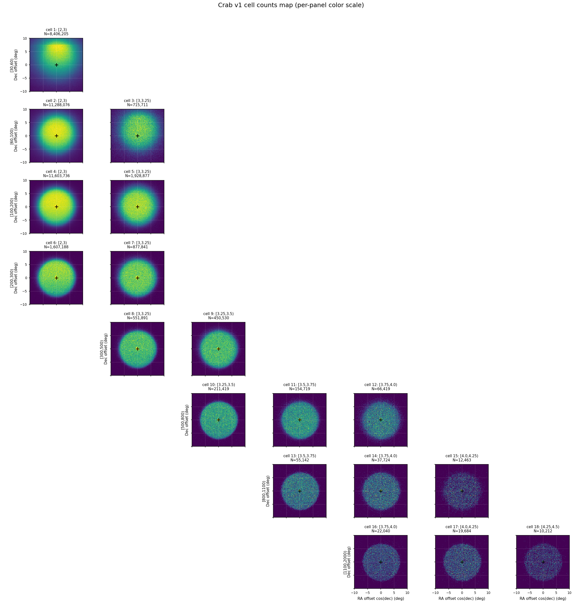
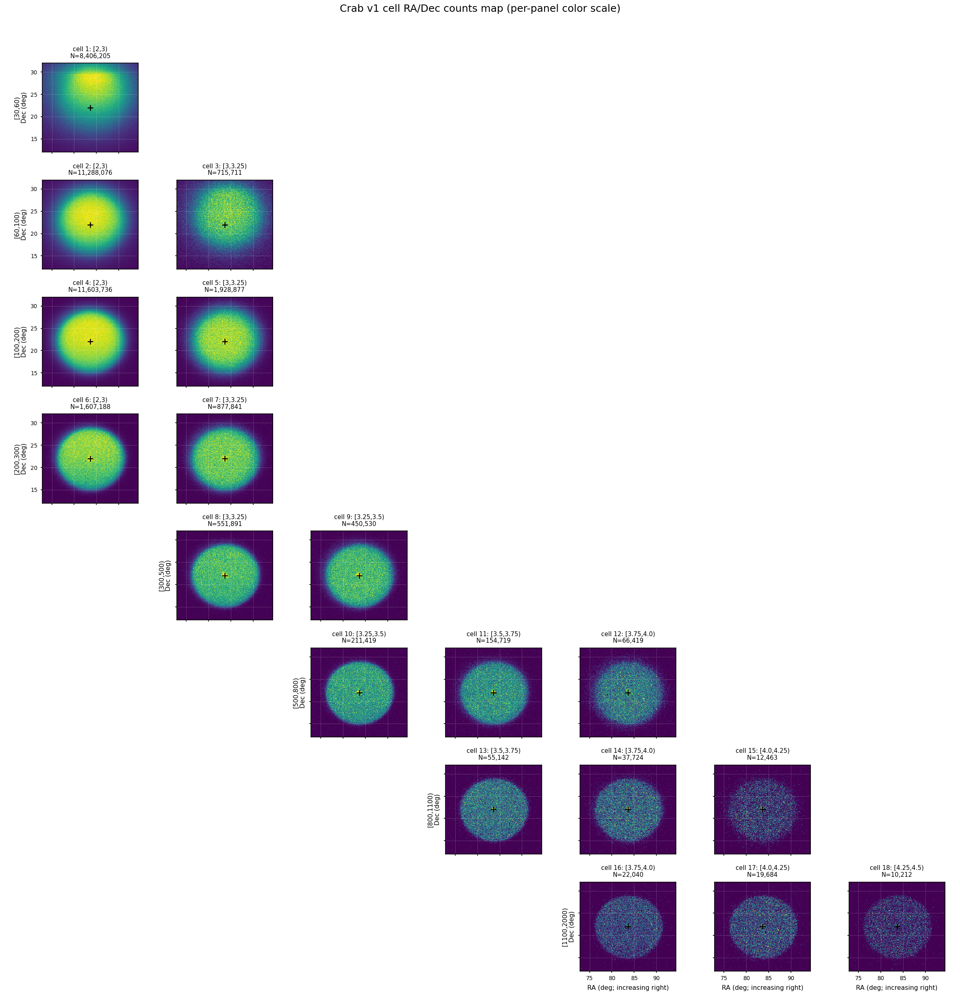
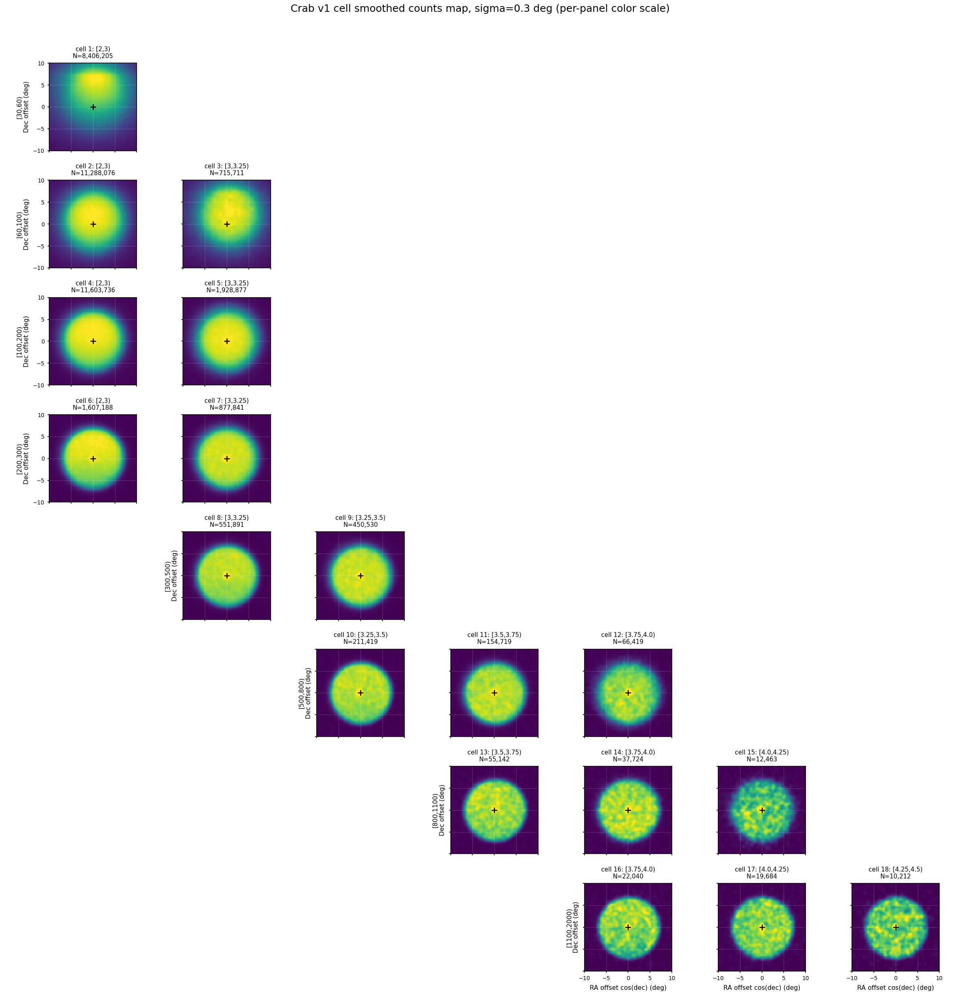
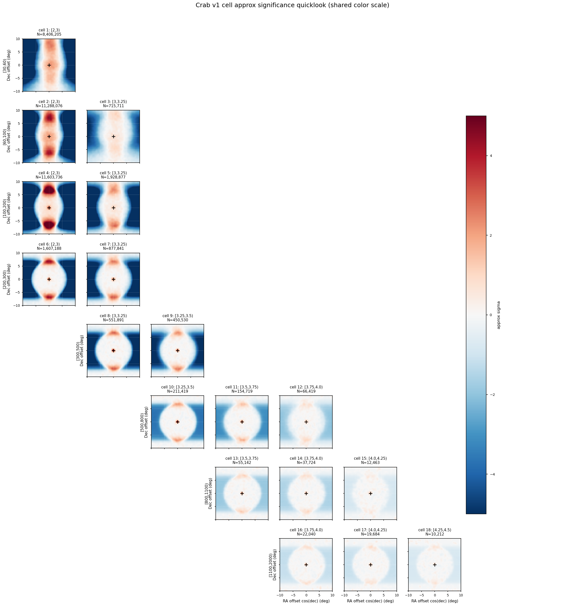
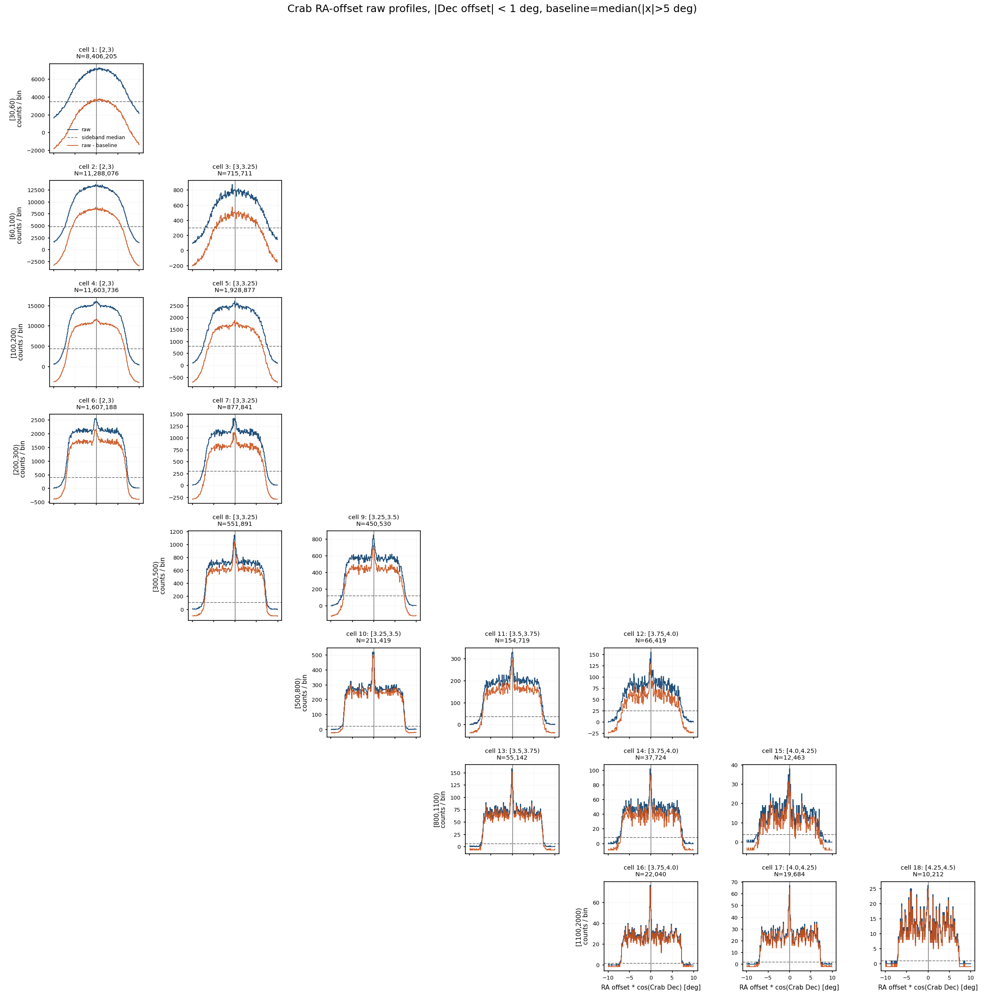
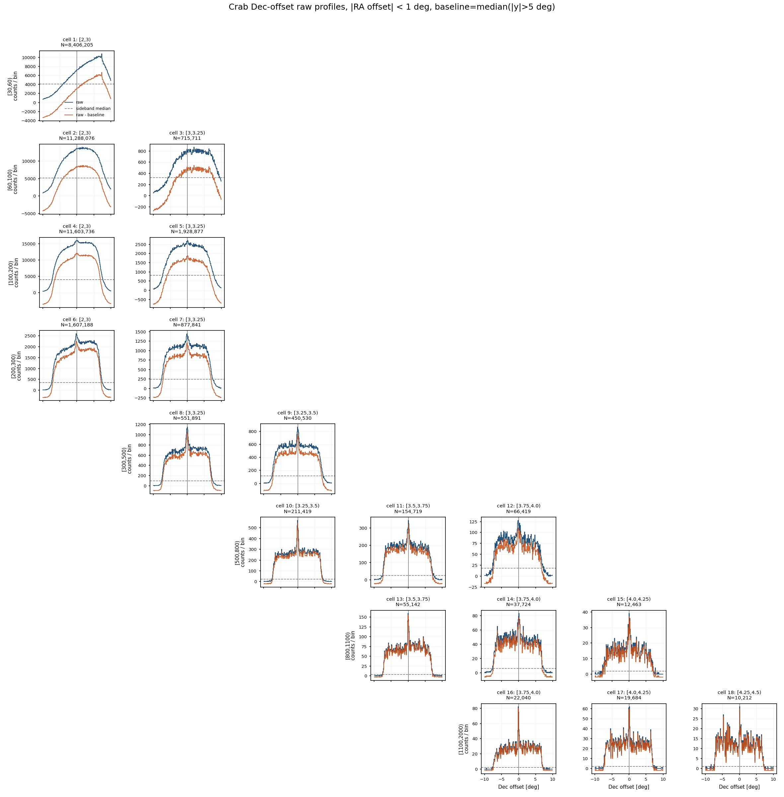
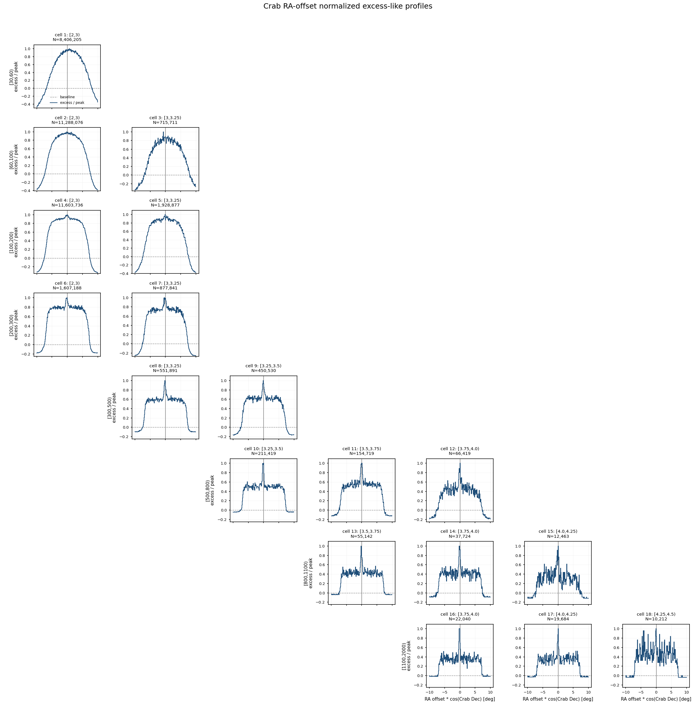
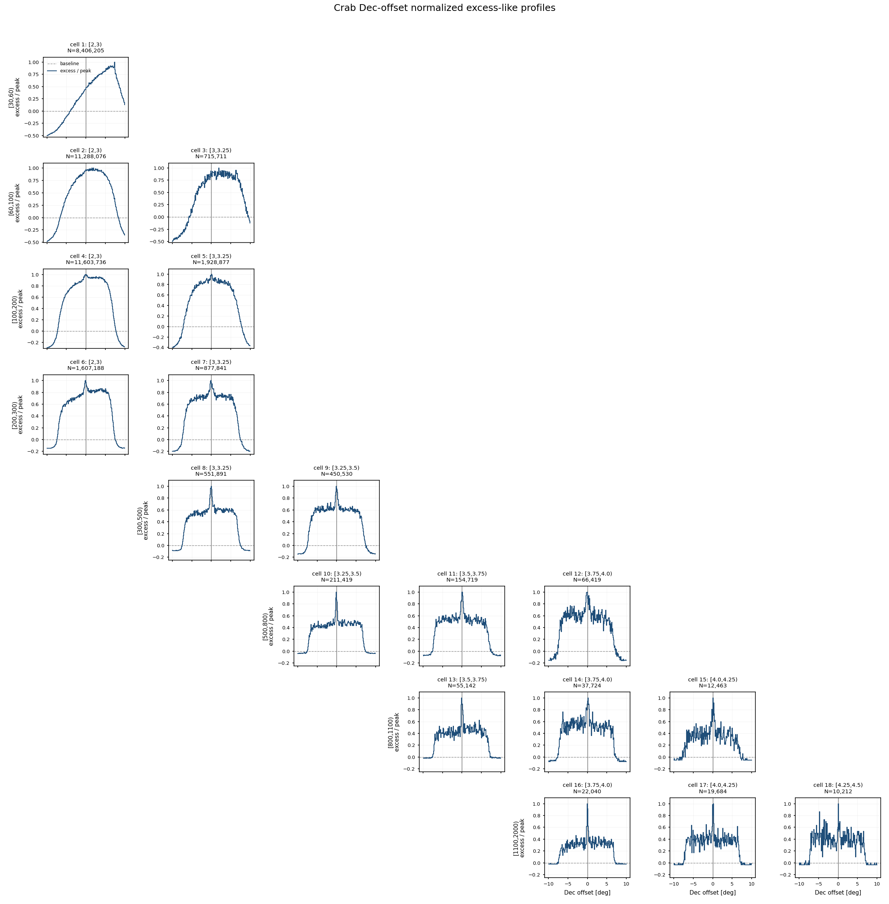

# Crab v1 Cell Sky Maps — 18 个 ML 能量 × Nhit 单元天图诊断

**日期：** 2026-05-23
**目标：** 对 `apply/config/cell_selection_v1.csv` 中的 18 个 v1 `(Nhit, log10 E_pred)` cell，分别绘制 Crab 附近观测事例的局部天图，检查方向坐标、cell 分箱、观测规约和后续背景估计前的输入质量。

这是一组 Stage C/D/E 之间的诊断图。当前产物包括 counts map、smoothed counts map，以及一个用等赤纬 sideband 近似背景得到的 quicklook significance map。第三类图只用于快速看结构，不作为最终物理背景或 Li-Ma 显著性结果。

---

## 1. 输入与选择

本次运行使用全量 observation eval ROOT 与 recovered-time friend tree：

| 项目 | 数值 / 路径 |
|---|---|
| 观测 eval ROOT | `/mnt/mydisk/WCDA_observation_eval/<MMDD>/Esg*.root` |
| recovered time ROOT | `/mnt/mydisk/WCDA_observation_eval/recovered_time/<MMDD>/*.time.root` |
| cell selection | `apply/config/cell_selection_v1.csv` |
| 画图脚本 | `apply/plot_crab_cell_skymaps.py` |
| 输出目录 | `apply/plot/crab_cell_skymaps/` |
| 输入文件对 | 1258 |
| entry 对齐方式 | 同名 ROOT 与 `.time.root` 按 entry 顺序对齐 |
| missing time files | 0 |
| entry mismatch files | 0 |

事件选择：

```text
match_status == 0
pincness < 1.1
fitstat == 0
theta < 50 deg
```

用于分 cell 的观测量：

```text
nv
ml_logE_pred
ra_mean_deg
dec_mean_deg
```

Crab 坐标固定为：

```text
RA  = 83.63 deg
Dec = 22.01 deg
```

---

## 2. 投影与图像参数

局部天图使用 Crab 中心附近的近似 tangent-plane offset：

```text
x = wrap(ra_mean_deg - RA_Crab) * cos(Dec_Crab)
y = dec_mean_deg - Dec_Crab
```

其中 `(0,0)` 是 Crab 位置，`x/y` 近似表示相对 Crab 的东西 / 南北方向角距离，单位都是 degree。`wrap` 用来处理 RA 的 0/360 deg 回绕；虽然 Crab 位于 RA ≈ 83.63 deg，不靠近回绕点，脚本仍然做了这个保护。

这里乘 `cos(Dec_Crab)` 是因为 RA 是沿赤纬圈量到的角度：同样的 RA 差，在实际天空上的横向角距离要乘以该赤纬圈半径相对赤道的比例 `cos(dec)`。Crab 的 Dec ≈ 22.01 deg，因此：

```text
1 deg RA at Crab Dec ≈ cos(22.01 deg) = 0.927 deg
```

所以 offset 图里的 `x` 更接近真实局部平面上的东西向角距离，而不是原始 RA 坐标差。这个近似在当前 10 deg half-width 的局部视场内足够作为诊断图使用。

默认图像参数：

| 参数 | 数值 |
|---|---:|
| ROI half-width | 10 deg |
| pixel size | 0.1 deg |
| 每个 cell map shape | 200 × 200 |
| smoothing sigma | 0.3 deg |
| source exclusion radius for sideband quicklook | 2.0 deg |
| sideband statistic | mean per Dec strip |
| quicklook sideband x range | `|RA offset * cos(Crab Dec)| < 5 deg` |
| RA/Dec counts RA range | 72.8439 deg 到 94.4161 deg |
| RA/Dec counts Dec range | 12.0100 deg 到 32.0100 deg |
| RA/Dec RA axis direction | RA 递增向右 |

---

## 3. 全量运行统计

全量命令：

```bash
/home/server/anaconda3/envs/py310/bin/python apply/plot_crab_cell_skymaps.py --print-every 100
```

总体统计：

| 指标 | 数值 |
|---|---:|
| processed files | 1258 / 1258 |
| total entries seen | 127,692,389 |
| cut + match events | 127,691,852 |
| Crab 10 deg ROI events, all cells | 45,502,526 |
| Crab 10 deg ROI events, selected v1 cells | 38,019,877 |
| selected v1 cells / all ROI | 83.56% |
| output map tensor shape | 18 × 200 × 200 |

每个 v1 cell 的事例数：

| cell | Nhit bin | log10 E_pred bin | cut + match events | Crab ROI events |
|---:|---|---|---:|---:|
| 1 | `[30,60)` | `[2,3)` | 24,516,301 | 8,406,205 |
| 2 | `[60,100)` | `[2,3)` | 30,974,777 | 11,288,076 |
| 3 | `[60,100)` | `[3,3.25)` | 2,297,063 | 715,711 |
| 4 | `[100,200)` | `[2,3)` | 30,297,474 | 11,603,736 |
| 5 | `[100,200)` | `[3,3.25)` | 5,575,540 | 1,928,877 |
| 6 | `[200,300)` | `[2,3)` | 4,025,524 | 1,607,188 |
| 7 | `[200,300)` | `[3,3.25)` | 2,376,396 | 877,841 |
| 8 | `[300,500)` | `[3,3.25)` | 1,400,831 | 551,891 |
| 9 | `[300,500)` | `[3.25,3.5)` | 1,230,287 | 450,530 |
| 10 | `[500,800)` | `[3.25,3.5)` | 532,506 | 211,419 |
| 11 | `[500,800)` | `[3.5,3.75)` | 424,891 | 154,719 |
| 12 | `[500,800)` | `[3.75,4.0)` | 200,583 | 66,419 |
| 13 | `[800,1100)` | `[3.5,3.75)` | 139,393 | 55,142 |
| 14 | `[800,1100)` | `[3.75,4.0)` | 102,608 | 37,724 |
| 15 | `[800,1100)` | `[4.0,4.25)` | 38,081 | 12,463 |
| 16 | `[1100,2000)` | `[3.75,4.0)` | 55,576 | 22,040 |
| 17 | `[1100,2000)` | `[4.0,4.25)` | 52,471 | 19,684 |
| 18 | `[1100,2000)` | `[4.25,4.5)` | 28,669 | 10,212 |

最低统计 cell 仍有 `10,212` 个 Crab ROI 事例，因此 counts map 作为首版 sanity check 是可用的。

---

## 4. Counts Map

Counts map 只显示观测事例数：

```text
N_data(x, y | cell b)
```

它的价值是检查：

1. cell 分箱是否能稳定覆盖 Crab 附近观测数据；
2. RA/Dec 与 recovered-time friend tree 的 entry 对齐是否正常；
3. 局部天空是否有明显空洞、条纹或坐标错位；
4. 高 Nhit / 高预测能量 cell 是否仍有足够统计。



---

## 5. RA/Dec Counts Map

为了直接检查绝对天球坐标，本次新增了一张 RA/Dec counts grid。它和上面的 offset counts map 使用完全相同的事件选择、ROI mask 和 18 个 v1 cell 分箱，只是填图时直接使用：

```text
x-axis = ra_mean_deg
y-axis = dec_mean_deg
```

图像范围对应当前 Crab ROI：

```text
RA  = RA_Crab ± half_width_deg / cos(Dec_Crab)
Dec = Dec_Crab ± half_width_deg
```

即 RA ≈ `[72.8439, 94.4161] deg`，Dec ≈ `[12.0100, 32.0100] deg`。每个 panel 中黑色 `+` 标记 Crab 位置 `(83.63, 22.01)`。

这张图采用普通数学坐标方向：**RA 递增向右**。这和 offset counts map 的 `x` 轴方向保持一致，便于逐 panel 对照；它没有采用部分天文图常见的 RA 递减向右画法。

两类图的用途不同：

- offset 图适合看源区、PSF、centroid 偏移，以及按角距离定义源区 / 背景区半径。
- RA/Dec 图适合直观看绝对天球坐标，确认事件是否落在预期 RA/Dec 范围，并检查坐标恢复是否有明显错位。



---

## 6. Smoothed Counts Map

Smoothed counts map 对每个 cell 的 counts map 做 `sigma = 0.3 deg` 的 Gaussian smoothing。这个版本主要用于肉眼检查局部结构和潜在源点，不改变原始 counts map 的定义。



---

## 7. Approx Sideband Significance Quicklook

第三张图使用一个非常简单的等赤纬 sideband 近似背景：

1. 对每个 cell 和每个 Dec strip，排除 Crab 中心 `2 deg` 内区域；
2. 只使用同一 strip 中 `r >= 2 deg` 且 `|RA offset * cos(Crab Dec)| < 5 deg` 的 RA-offset bins；
3. 对这些 bins 取 mean 作为该 Dec strip 的局部背景水平；
4. 不使用 `|RA offset * cos(Crab Dec)| >= 5 deg` 的 ROI 边缘区域，因为 raw RA-offset profile 显示这些区域更容易受边缘覆盖和 acceptance 结构影响；
5. 对 counts 和 background 都做 `0.3 deg` smoothing；
6. 计算：

```text
approx_sigma = (smoothed_counts - smoothed_background) / sqrt(smoothed_background)
```

这不是直接积分法背景，也不是 Li-Ma significance。它只用于快速诊断源区是否在高贡献 cell 中冒出来，以及是否存在大尺度结构或明显 acceptance 问题。



---

## 8. Profile Diagnostics

为了更直接地检查中心亮斑在东西 / 南北两个方向上的宽度，本次从 raw counts map 额外投影出一组一维 profile。它们仍然是 **raw counts 诊断图**，没有做正式背景模型或 acceptance 校正，因此不能解释为 Crab 的真实角直径。

定义如下：

```text
RA-offset profile:
  select |Dec offset| < 1 deg
  sum counts along y
  plot counts vs x = RA offset * cos(Crab Dec)

Dec-offset profile:
  select |RA offset * cos(Crab Dec)| < 1 deg
  sum counts along x
  plot counts vs y = Dec offset
```

每个 profile 还用远离中心的 sideband 估计一个简单基线：

```text
baseline = median(profile bins with |offset| > 5 deg)
normalized profile = (profile - baseline) / max(profile - baseline)
```

Raw profile 用来看统计量、背景水平和 acceptance 梯度；normalized profile 用来把不同 cell 的峰值拉到同一尺度，方便比较中心 excess 的宽度。由于这些曲线仍然包含 cosmic-ray 背景和 acceptance 结构，它们只能回答诊断问题：

1. 中心 excess 是否在 `(0,0)` 附近；
2. RA-offset 和 Dec-offset 两个方向是否大致对称；
3. 高 Nhit / 高预测能量 cell 的中心结构是否有变窄趋势；
4. 某些 cell 是否出现异常偏心、宽尾或大尺度背景结构。

### Raw Profiles





### Normalized Excess-like Profiles





---

## 9. 当前结论

1. **数据连接是干净的。** 1258 对 eval ROOT 与 recovered-time ROOT 全部找到，`t_eventout` 与 `t_recovered_time` 没有 entry mismatch。
2. **18 个 v1 cell 都有足够统计。** 全量 Crab ROI 中，v1 selected cells 合计 `38,019,877` 个事例；最低统计 cell 仍有 `10,212` 个 ROI 事例。
3. **counts map 可以作为 Stage C 输出质量检查。** Offset counts 图和 RA/Dec counts 图能从局部角距离与绝对天球坐标两种视角检查坐标、cell 分箱、friend tree 对齐和局部天空覆盖。
4. **profile 图显示中心结构是否稳定，但不能给出源尺寸。** 它们是 raw counts map 的一维投影，仍包含背景和 acceptance，只能用于检查中心位置、RA/Dec 方向对称性和不同 cell 的相对宽窄。
5. **quicklook significance 只能作诊断。** 它没有替代 Stage D 的直接积分法背景，不能用于最终 SED 或物理显著性声明。

---

## 10. 下一步

1. 实现 Stage D 的正式背景估计：直接积分法或严格等赤纬背景。
2. 输出每个 cell 的 `background map`、`excess map` 和 Li-Ma `significance map`。
3. 将 smoothing 半径从统一 `0.3 deg` 改为按 cell 的 PSF `sigma_b` 设置。
4. 对高贡献 cell 检查 Crab spot 的 centroid 与宽度，确认坐标和 PSF 没有系统偏移。
5. 将正式 `N_on / N_off / alpha / excess / significance` 接入后续 forward-folding SED 拟合。

---

## 11. 产物清单

本次诊断生成的本地文件：

```text
apply/plot_crab_cell_skymaps.py
apply/plot/crab_cell_skymaps/crab_v1_counts_grid.png
apply/plot/crab_cell_skymaps/crab_v1_counts_radec_grid.png
apply/plot/crab_cell_skymaps/crab_v1_smoothed_counts_grid.png
apply/plot/crab_cell_skymaps/crab_v1_approx_significance_grid.png
apply/plot/crab_cell_skymaps/crab_v1_ra_offset_profiles_grid.png
apply/plot/crab_cell_skymaps/crab_v1_dec_offset_profiles_grid.png
apply/plot/crab_cell_skymaps/crab_v1_ra_offset_profiles_normalized_grid.png
apply/plot/crab_cell_skymaps/crab_v1_dec_offset_profiles_normalized_grid.png
apply/plot/crab_cell_skymaps/crab_v1_maps.npz
apply/plot/crab_cell_skymaps/crab_v1_maps_meta.json
```

报告源文件：

```text
apply/report/crab_v1_cell_skymaps.md
```
