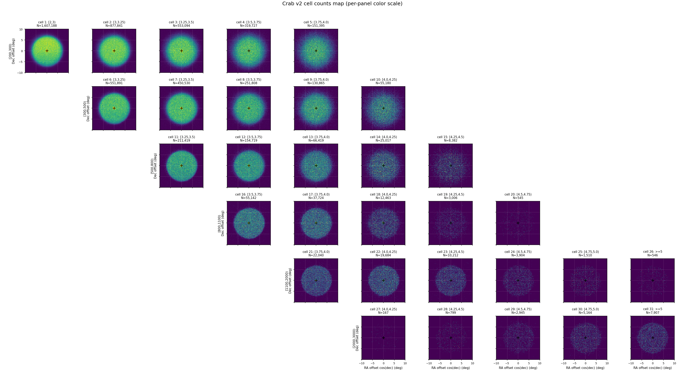
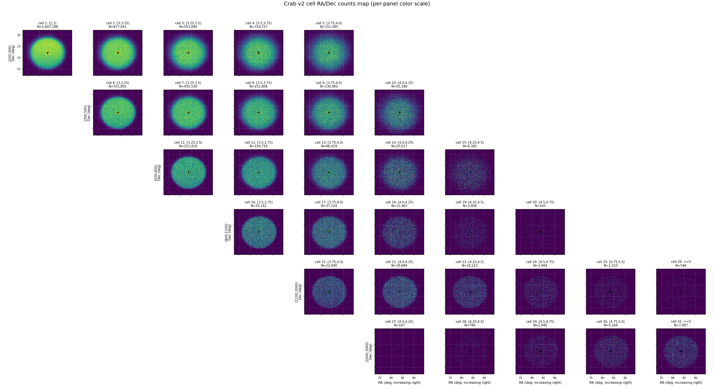
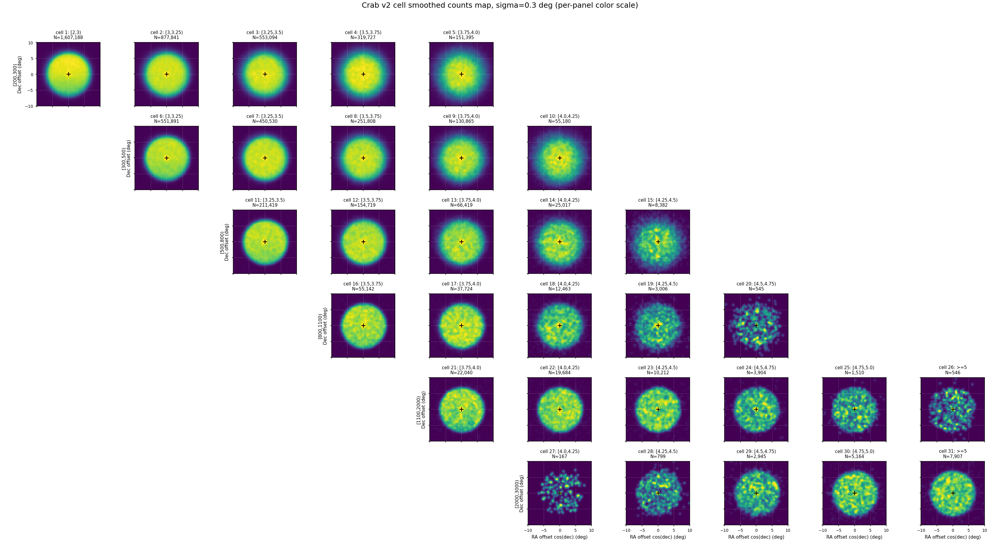
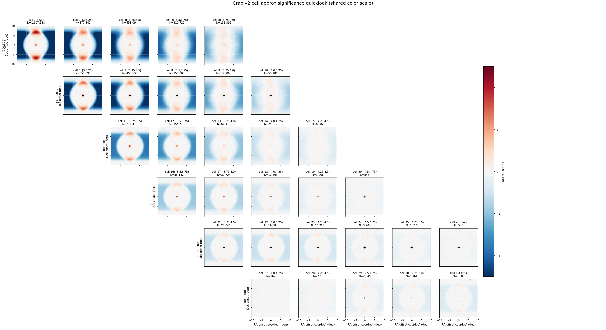
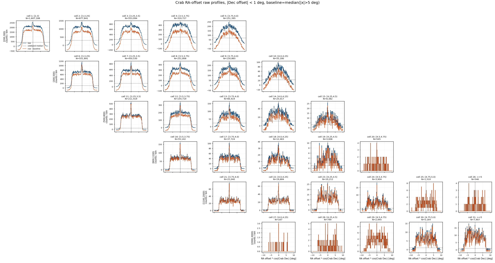
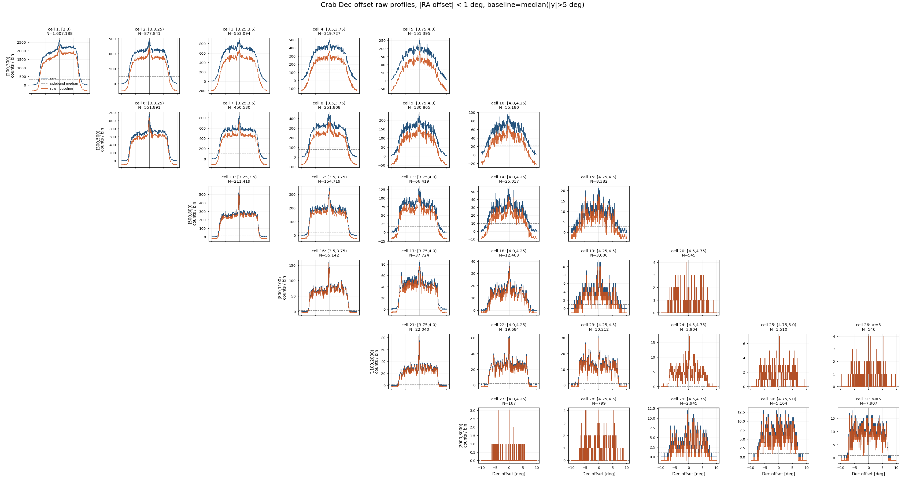
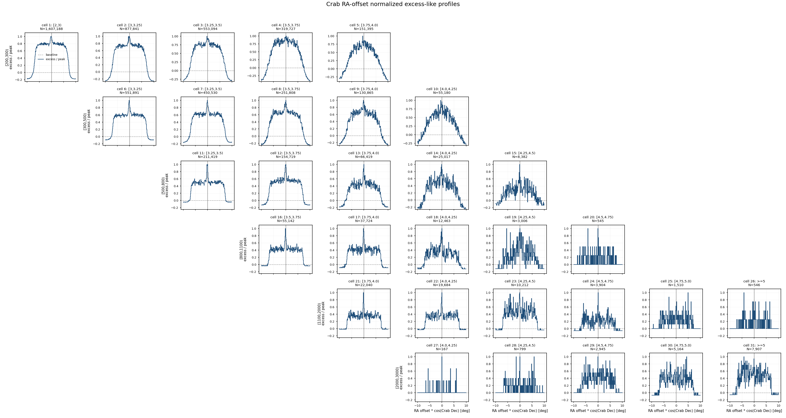
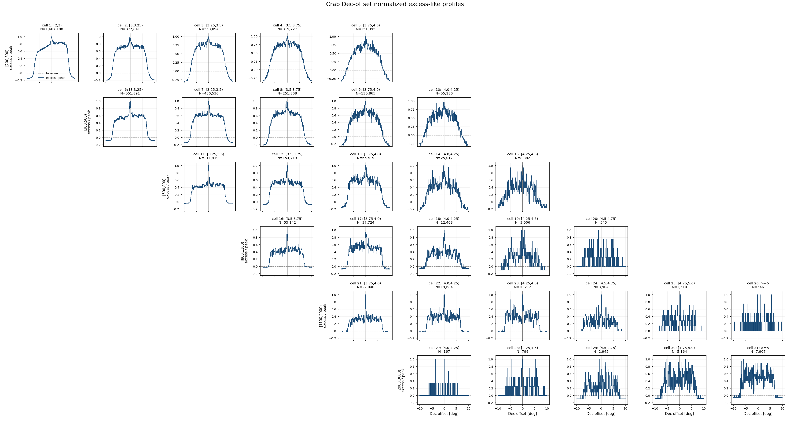

# Crab v2 Cell Sky Maps — ML 能量 × Nhit 单元天图诊断

**日期：** 2026-06-08
**目标：** 对 `apply/config/cell_selection_v2.csv` 中的 31 个 v2 `(Nhit, log10 E_pred)` cell，复刻 v1 sky-map 诊断流程，检查 Crab 附近观测事例在新 cell 设计下的空间分布、坐标对齐、中心亮斑和高能端统计。

本报告只做 skymap quicklook 诊断，不代表正式 Stage D 直接积分法背景，也不替代后续 SED forward-folding。v2 的核心变化是：只保留 `Nhit >= 200`，新增 `[2000,3000)` Nhit 行，并把高 Nhit 行的 `ml_logE_pred` 拓展到 `[4.75,5.0)` 和 `>=5`。

---

## 1. 输入与选择

本次运行使用全量 observation eval ROOT 与 recovered-time friend tree：

| 项目 | 数值 / 路径 |
|---|---|
| 观测 eval ROOT | `/mnt/mydisk/WCDA_observation_eval/<MMDD>/Esg*.root` |
| recovered time ROOT | `/mnt/mydisk/WCDA_observation_eval/recovered_time/<MMDD>/*.time.root` |
| cell selection | `apply/config/cell_selection_v2.csv` |
| 画图脚本 | `apply/plot_crab_cell_skymaps.py` |
| 输出目录 | `apply/plot/crab_cell_skymaps_v2/` |
| 输入文件对 | 1258 |
| entry 对齐方式 | 同名 ROOT 与 `.time.root` 按 entry 顺序对齐 |
| missing time files | 0 |
| entry mismatch files | 0 |

事件选择：

```text
match_status == 0
pincness < 1.1
fitstat == 0
theta < 50 deg
```

用于分 cell 的观测量：

```text
nv
ml_logE_pred
ra_mean_deg
dec_mean_deg
```

Crab 坐标固定为：

```text
RA  = 83.63 deg
Dec = 22.01 deg
```

---

## 2. v2 Cell 设计

v2 cell 不再使用 v1 中的低 Nhit 行：

```text
[30,60), [60,100), [100,200)
```

保留并扩展的 Nhit 行为：

```text
[200,300), [300,500), [500,800), [800,1100), [1100,2000), [2000,3000)
```

`ml_logE_pred` 仍按 physical ridge 收束，而不是把所有 acceptable 高能长尾都纳入。低 Nhit 行只保留到较低预测能量，高 Nhit 行逐步拓展到 `>=5`。`[2000,3000)` 的 `mc_count` 当前使用旧 `>=2000` summary 作为参考，正式 MC 分箱后需要再确认。

### v2.1 ROI 统计门槛

根据本次 v2 skymap 的 Crab ROI 统计，新增一个更适合后续 baseline 的选择文件：

```text
apply/config/cell_selection_v2p1.csv
```

v2p1 使用硬门槛：

```text
Crab 10 deg ROI events >= 5,000
```

因此从 31 个 v2 cell 中保留 23 个，剔除 8 个低统计 cell。v2p1 文件保留原 v2 `cell_id`，方便和本报告的 31-panel skymap 直接对照。

剔除 cell 如下：

| cell | Nhit bin | log10 E_pred bin | cut + match events | Crab ROI events | 处理 |
|---:|---|---|---:|---:|---|
| 19 | `[800,1100)` | `[4.25,4.5)` | 10,264 | 3,006 | drop |
| 20 | `[800,1100)` | `[4.5,4.75)` | 2,001 | 545 | drop |
| 24 | `[1100,2000)` | `[4.5,4.75)` | 11,716 | 3,904 | drop |
| 25 | `[1100,2000)` | `[4.75,5.0)` | 4,580 | 1,510 | drop |
| 26 | `[1100,2000)` | `>=5` | 1,934 | 546 | drop |
| 27 | `[2000,3000)` | `[4.0,4.25)` | 391 | 167 | drop |
| 28 | `[2000,3000)` | `[4.25,4.5)` | 2,201 | 799 | drop |
| 29 | `[2000,3000)` | `[4.5,4.75)` | 7,251 | 2,945 | drop |

保留 cell 为：

```text
1-18, 21-23, 30-31
```

这个规则的物理含义是：v2 skymap 仍展示完整 31-cell 设计，用于诊断高能端和边界 cell；v2p1 则作为后续响应、PSF、背景和拟合的更稳 baseline，避免把 Crab ROI 统计不足的 panel 带入正式链路。

---

## 3. 投影与图像参数

局部天图使用 Crab 中心附近的近似 tangent-plane offset：

```text
x = wrap(ra_mean_deg - RA_Crab) * cos(Dec_Crab)
y = dec_mean_deg - Dec_Crab
```

其中 `(0,0)` 是 Crab 位置，`x/y` 近似表示相对 Crab 的东西 / 南北方向角距离，单位都是 degree。`wrap` 用来处理 RA 的 0/360 deg 回绕。

这里乘 `cos(Dec_Crab)` 是因为 RA 是沿赤纬圈量到的角度：同样的 RA 差，在实际天空上的横向角距离要乘以该赤纬圈半径相对赤道的比例 `cos(dec)`。Crab 的 Dec ≈ 22.01 deg，因此：

```text
1 deg RA at Crab Dec ≈ cos(22.01 deg) = 0.927 deg
```

offset 图适合看源区、PSF、centroid 偏移，以及按角距离定义源区 / 背景区半径。RA/Dec 图适合直观看绝对天球坐标，确认事件是否落在预期 RA/Dec 范围。

默认图像参数：

| 参数 | 数值 |
|---|---:|
| ROI half-width | 10 deg |
| pixel size | 0.1 deg |
| 每个 cell map shape | 200 x 200 |
| smoothing sigma | 0.3 deg |
| source exclusion radius for sideband quicklook | 2.0 deg |
| sideband statistic | mean per Dec strip |
| quicklook sideband x range | `|RA offset * cos(Crab Dec)| < 5 deg` |
| RA/Dec counts RA range | 72.8439 deg 到 94.4161 deg |
| RA/Dec counts Dec range | 12.0100 deg 到 32.0100 deg |
| RA/Dec RA axis direction | RA 递增向右 |

---

## 4. 全量运行统计

全量命令：

```bash
/home/server/anaconda3/envs/py310/bin/python apply/plot_crab_cell_skymaps.py \
  --analysis-version v2 \
  --output-prefix crab_v2 \
  --cell-selection-csv apply/config/cell_selection_v2.csv \
  --output-dir apply/plot/crab_cell_skymaps_v2 \
  --print-every 100
```

总体统计：

| 指标 | 数值 |
|---|---:|
| processed files | 1258 / 1258 |
| total entries seen | 127,692,389 |
| cut + match events | 127,691,852 |
| Crab 10 deg ROI events, all cells | 45,502,526 |
| Crab 10 deg ROI events, selected v2 cells | 5,599,233 |
| selected v2 cells / all ROI | 12.31% |
| output map tensor shape | 31 x 200 x 200 |

每个 v2 cell 的事例数：

| cell | Nhit bin | log10 E_pred bin | cut + match events | Crab ROI events |
|---:|---|---|---:|---:|
| 1 | `[200,300)` | `[2,3)` | 4,025,524 | 1,607,188 |
| 2 | `[200,300)` | `[3,3.25)` | 2,376,396 | 877,841 |
| 3 | `[200,300)` | `[3.25,3.5)` | 1,587,585 | 553,094 |
| 4 | `[200,300)` | `[3.5,3.75)` | 953,366 | 319,727 |
| 5 | `[200,300)` | `[3.75,4.0)` | 468,450 | 151,395 |
| 6 | `[300,500)` | `[3,3.25)` | 1,400,831 | 551,891 |
| 7 | `[300,500)` | `[3.25,3.5)` | 1,230,287 | 450,530 |
| 8 | `[300,500)` | `[3.5,3.75)` | 741,698 | 251,808 |
| 9 | `[300,500)` | `[3.75,4.0)` | 400,758 | 130,865 |
| 10 | `[300,500)` | `[4.0,4.25)` | 172,853 | 55,180 |
| 11 | `[500,800)` | `[3.25,3.5)` | 532,506 | 211,419 |
| 12 | `[500,800)` | `[3.5,3.75)` | 424,891 | 154,719 |
| 13 | `[500,800)` | `[3.75,4.0)` | 200,583 | 66,419 |
| 14 | `[500,800)` | `[4.0,4.25)` | 80,068 | 25,017 |
| 15 | `[500,800)` | `[4.25,4.5)` | 26,331 | 8,382 |
| 16 | `[800,1100)` | `[3.5,3.75)` | 139,393 | 55,142 |
| 17 | `[800,1100)` | `[3.75,4.0)` | 102,608 | 37,724 |
| 18 | `[800,1100)` | `[4.0,4.25)` | 38,081 | 12,463 |
| 19 | `[800,1100)` | `[4.25,4.5)` | 10,264 | 3,006 |
| 20 | `[800,1100)` | `[4.5,4.75)` | 2,001 | 545 |
| 21 | `[1100,2000)` | `[3.75,4.0)` | 55,576 | 22,040 |
| 22 | `[1100,2000)` | `[4.0,4.25)` | 52,471 | 19,684 |
| 23 | `[1100,2000)` | `[4.25,4.5)` | 28,669 | 10,212 |
| 24 | `[1100,2000)` | `[4.5,4.75)` | 11,716 | 3,904 |
| 25 | `[1100,2000)` | `[4.75,5.0)` | 4,580 | 1,510 |
| 26 | `[1100,2000)` | `>=5` | 1,934 | 546 |
| 27 | `[2000,3000)` | `[4.0,4.25)` | 391 | 167 |
| 28 | `[2000,3000)` | `[4.25,4.5)` | 2,201 | 799 |
| 29 | `[2000,3000)` | `[4.5,4.75)` | 7,251 | 2,945 |
| 30 | `[2000,3000)` | `[4.75,5.0)` | 13,339 | 5,164 |
| 31 | `[2000,3000)` | `>=5` | 22,973 | 7,907 |

最低统计 cell 是 `[2000,3000) x [4.0,4.25)`，Crab ROI 只有 `167` 个事件。这个 cell 在 counts map 中主要作为高 Nhit 低预测能量边界的诊断点，不应被当作稳定高贡献 cell。

---

## 5. Counts Map

Counts map 只显示观测事例数：

```text
N_data(x, y | cell b)
```

它用于检查 v2 cell 下 Crab 附近观测数据的覆盖、坐标对齐、entry 对齐和异常结构。



---

## 6. RA/Dec Counts Map

RA/Dec counts grid 和 offset counts map 使用完全相同的事件选择、ROI mask 和 31 个 v2 cell 分箱，只是填图时直接使用：

```text
x-axis = ra_mean_deg
y-axis = dec_mean_deg
```

图像范围对应当前 Crab ROI：

```text
RA  = RA_Crab +/- half_width_deg / cos(Dec_Crab)
Dec = Dec_Crab +/- half_width_deg
```

即 RA ≈ `[72.8439, 94.4161] deg`，Dec ≈ `[12.0100, 32.0100] deg`。每个 panel 中黑色 `+` 标记 Crab 位置 `(83.63, 22.01)`。

这张图采用普通数学坐标方向：**RA 递增向右**。它没有采用部分天文图常见的 RA 递减向右画法。



---

## 7. Smoothed Counts Map

Smoothed counts map 对每个 cell 的 counts map 做 `sigma = 0.3 deg` 的 Gaussian smoothing。这个版本主要用于肉眼检查局部结构和潜在源点，不改变原始 counts map 的定义。



---

## 8. Approx Sideband Significance Quicklook

第三张图使用简单等赤纬 sideband 近似背景：

1. 对每个 cell 和每个 Dec strip，排除 Crab 中心 `2 deg` 内区域；
2. 只使用同一 strip 中 `r >= 2 deg` 且 `|RA offset * cos(Crab Dec)| < 5 deg` 的 RA-offset bins；
3. 对这些 bins 取 mean 作为该 Dec strip 的局部背景水平；
4. 不使用 `|RA offset * cos(Crab Dec)| >= 5 deg` 的 ROI 边缘区域；
5. 对 counts 和 background 都做 `0.3 deg` smoothing；
6. 计算：

```text
approx_sigma = (smoothed_counts - smoothed_background) / sqrt(smoothed_background)
```

这不是直接积分法背景，也不是 Li-Ma significance。它只用于快速诊断源区是否在高贡献 cell 中出现，以及是否存在大尺度结构或明显 acceptance 问题。



---

## 9. Profile Diagnostics

Profile 图从 raw counts map 投影得到，仍然包含背景和 acceptance 结构，不能解释为 Crab 的真实角直径。

定义如下：

```text
RA-offset profile:
  select |Dec offset| < 1 deg
  sum counts along y
  plot counts vs x = RA offset * cos(Crab Dec)

Dec-offset profile:
  select |RA offset * cos(Crab Dec)| < 1 deg
  sum counts along x
  plot counts vs y = Dec offset
```

Raw profile 用来看统计量、背景水平和 acceptance 梯度；normalized profile 用来把不同 cell 的峰值拉到同一尺度，方便比较中心 excess 的宽度。它们主要回答：

1. 中心 excess 是否在 `(0,0)` 附近；
2. RA-offset 和 Dec-offset 两个方向是否大致对称；
3. 高 Nhit / 高预测能量 cell 的中心结构是否有变窄趋势；
4. 某些 cell 是否出现异常偏心、宽尾或大尺度背景结构。

### Raw Profiles





### Normalized Excess-like Profiles





---

## 10. 当前结论

1. **数据连接仍然干净。** 1258 对 eval ROOT 与 recovered-time ROOT 全部找到，`t_eventout` 与 `t_recovered_time` 没有 entry mismatch。
2. **v2 显著压缩了低 Nhit 背景。** v1 selected cells 覆盖 Crab ROI 的 `83.56%`，v2 selected cells 覆盖 `12.31%`，因为 v2 删除了 `[30,200)` 的大背景行。
3. **高能端统计差异很大。** v2 最高统计 cell 有 `1,607,188` 个 Crab ROI 事件，但最低 cell 只有 `167` 个；因此已新增 `cell_selection_v2p1.csv`，用 `Crab ROI >= 5,000` 剔除 8 个低统计 cell。
4. **offset 和 RA/Dec 图提供互补检查。** offset 图适合看源区、PSF 和 centroid；RA/Dec 图适合确认绝对天球坐标范围。
5. **quicklook significance 和 profiles 仍只是诊断。** 这些图没有替代 Stage D 直接积分法背景，不能用于最终 SED 或物理显著性声明。

---

## 11. 下一步

1. 用 v2 Nhit 分箱重新跑 MC binned cache，正式拆出 `[2000,3000)`，确认 v2p1 cell 的 MC count 和响应稳定性。
2. 基于 `cell_selection_v2p1.csv` 重跑 Stage A response、Stage B PSF、Stage C observation reduction 和 Stage D background。
3. 用 Stage D 背景输出正式 excess map 和 Li-Ma significance map。

---

## 12. 产物清单

本次诊断生成的本地文件：

```text
apply/config/cell_selection_v2.csv
apply/config/cell_selection_v2p1.csv
apply/plot_crab_cell_skymaps.py
apply/plot/crab_cell_skymaps_v2/crab_v2_counts_grid.png
apply/plot/crab_cell_skymaps_v2/crab_v2_counts_radec_grid.png
apply/plot/crab_cell_skymaps_v2/crab_v2_smoothed_counts_grid.png
apply/plot/crab_cell_skymaps_v2/crab_v2_approx_significance_grid.png
apply/plot/crab_cell_skymaps_v2/crab_v2_ra_offset_profiles_grid.png
apply/plot/crab_cell_skymaps_v2/crab_v2_dec_offset_profiles_grid.png
apply/plot/crab_cell_skymaps_v2/crab_v2_ra_offset_profiles_normalized_grid.png
apply/plot/crab_cell_skymaps_v2/crab_v2_dec_offset_profiles_normalized_grid.png
apply/plot/crab_cell_skymaps_v2/crab_v2_maps.npz
apply/plot/crab_cell_skymaps_v2/crab_v2_maps_meta.json
```

报告源文件：

```text
apply/report/crab_v2_cell_skymaps.md
```
