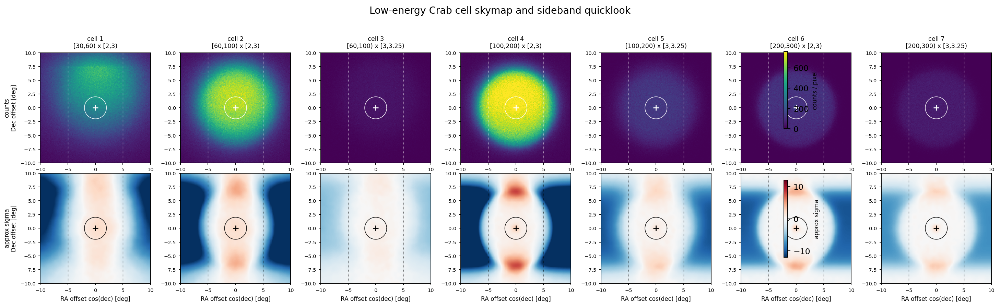
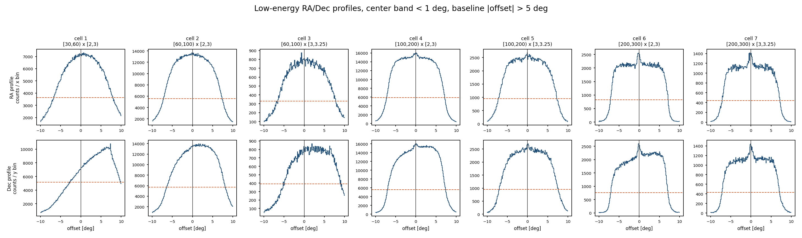

# Low-Energy Cell Skymap / Sideband Diagnostics

This diagnostic focuses on v1 cells 1-7, which dominate the Stage F chi2 after the S0 unit fix.
The sideband quicklook is not a replacement for Stage D physics background.

- Source-region quicklook: rho < 2 deg
- Sideband quicklook: same Dec strip, rho >= 2 deg, |x| < 5 deg
- Summary CSV: `/mnt/mydisk/server/projects/energy_reconstruction/apply/plot/low_energy_cell_diagnostics/low_energy_cell_diagnostics.csv`

| cell | Nhit | predE | central excess-like | central approx sigma | sideband CV | left-right asym | Stage F excess/model | Stage F pull | flag |
| ---: | --- | --- | ---: | ---: | ---: | ---: | ---: | ---: | --- |
| 1 | [30,60) | [2,3) | 40619 | 63.73 | 0.5488 | -0.04918 | 50.76 | 41.42 | exclude_from_stage_g_baseline |
| 2 | [60,100) | [2,3) | 57214 | 64.85 | 0.5486 | -0.005753 | 4.888 | 21.2 | exclude_from_stage_g_baseline |
| 3 | [60,100) | [3,3.25) | 4365.3 | 20.75 | 0.5611 | -0.06258 | 19.26 | 11.37 | exclude_from_stage_g_baseline |
| 4 | [100,200) | [2,3) | 35320 | 36.87 | 0.6641 | 0.01079 | 0.544 | -8.941 | exclude_from_stage_g_baseline |
| 5 | [100,200) | [3,3.25) | 7704.4 | 19.97 | 0.6312 | -0.001447 | 2.395 | 5.456 | exclude_from_stage_g_baseline |
| 6 | [200,300) | [2,3) | 4743 | 13.03 | 0.7413 | 0.006002 | 0.7875 | -4.866 | exclude_from_stage_g_baseline |
| 7 | [200,300) | [3,3.25) | 2912.7 | 10.95 | 0.7156 | 0.005279 | 1.504 | 5.366 | exclude_from_stage_g_baseline |
