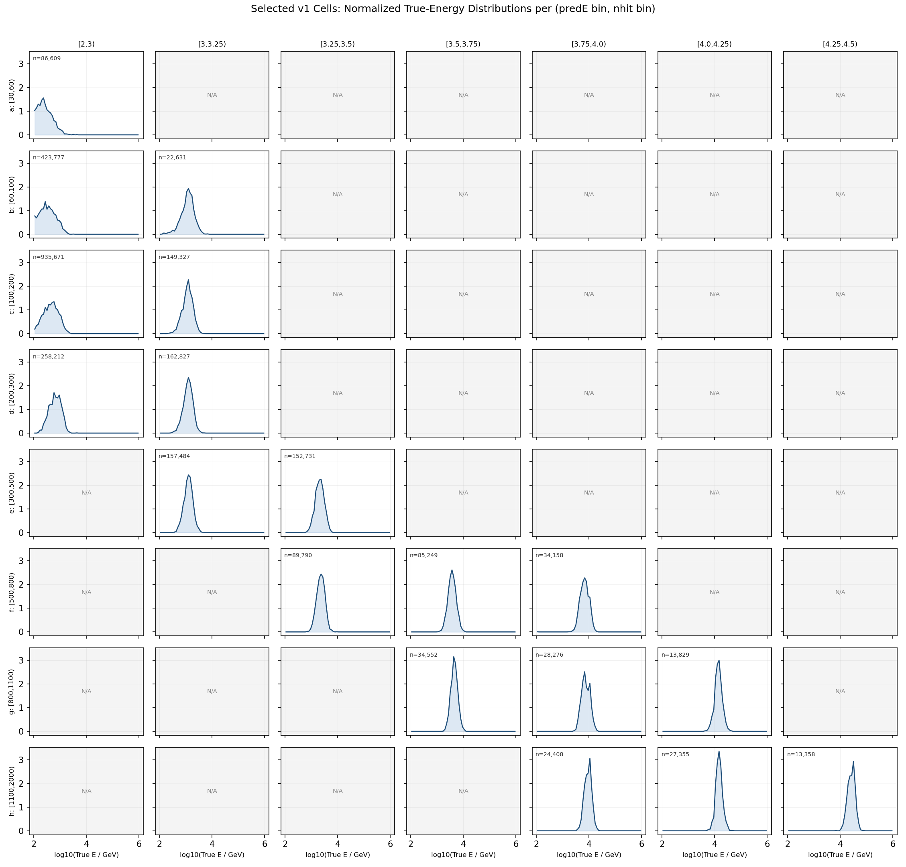

# Crab SED 技术路线（ML 能量 × Nhit 二维分箱）

**目标。** 在 WCDA 两个月（2022-01-01 至 2022-02-28）Crab 观测数据上复现 Crab Nebula 的 SED，用以验证基于 ParticleNet 的单事例能量重建。分箱方案在标准 WCDA forward folding 之上扩展为 **(Nhit, log₁₀ E_pred) 二维网格**。

参考：胡世聪博士论文 *LHAASO-WCDA 伽马源分析与源表*（2023），第 6 章 + GRB 221009A 附录。

---

## 1. 为什么用二维分箱而不是只用 Nhit

WCDA 传统流水线（胡 2023, §6.2）只沿一个轴 `Nq05t30` 分箱，把假设的源能谱通过探测器响应 η(θ, E) 前向折叠成每个 Nhit 段的预期事例数。它不直接按重建能量分箱，**根本原因是只靠水池重建出来的单事例能量分辨率太差，没有实际价值**。

现在 ML 回归器（`runs/theta_recoxy_position_embed_midenergy_8666`）给出每个事例一个 `log10(E_pred / GeV)`，它的分辨率足够好，可以作为有用的第二条分箱轴。把它作为第二维度加进去做了两件事：

1. **在固定的 Nhit 段内**，按 log E_pred 再切一刀，把原本混在一起、真能量不同的事例分开。这让响应矩阵更"陡"，给拟合提供了额外的谱形信息。
2. **Nhit 轴依然保留**，因此分析仍然能直接和已发表的 WCDA 一期星表结果（胡 2023, 图 6-32）对比 — 把二维响应沿 log E_pred 轴 marginalise 回去就能恢复一维 Nhit-only 拟合。

这种思路结构上和 IACT 把"重建能量"和"重建 gamma/hadron 判别值"分别作为独立分箱轴是一样的：第二条轴允许有噪声，响应矩阵会把它处理掉。

二维网格已经在 `apply/simulation_all_bin.py` 里做过原型，输出在 `apply/summary_selectedcuts/bin_counts.md`：

- **Nhit 分箱（8 段）：** `[30,60), [60,100), [100,200), [200,300), [300,500), [500,800), [800,1100), [1100,2000)`
- **log₁₀ E_pred 分箱（11 段）：** `<2, [2,3), [3,3.25), [3.25,3.5), [3.5,3.75), [3.75,4.0), [4.0,4.25), [4.25,4.5), [4.5,4.75), [4.75,5.0), >=5`
- 88 个正式内部单元里有 60 个标为 `acceptable`（cut 后 MC 事例数 ≥ ~1000），它们作为候选池。v1 拟合进一步收束到 `apply/config/cell_selection_v1.csv` 里的 18 个 physical-band 单元，避免过多低贡献格点拖大 χ² 自由度。

观测端的 Nhit 用 ROOT 文件里的 `nv` 分支（和 `simulation_all_bin.py:get_nhit_value` 用的代理变量一致）。

### v1 cell 选择依据

18 个 v1 单元不是按单一 count 阈值机械截出来的，而是从 60 个 `acceptable` 候选单元里手动收束出的 baseline physical band。选择规则记录在 `apply/config/cell_selection_v1.csv` 的 `selection_reason` 列里，核心依据是：

1. **先保留 formal Nhit 范围。** v1 只在 `[30,2000)` 的 8 个正式 Nhit bin 内选单元。`<30` 和 `>=2000` 作为 overflow/out-of-range 诊断，不进 baseline。已有 MC 统计里 `>=2000` 共有 20,599 个 cut 后事例，只占 formal `[30,2000)` 的 0.61%；加入会多出 5 个 acceptable cell，但对 v1 统计增益不到 1%，反而增加最高能端响应和背景的不稳定性。
2. **每个 Nhit 行至少保留一个主带单元。** 这样响应矩阵覆盖完整的 Nhit 动态范围，不会让某一段 shower size 在拟合中完全缺席。
3. **沿高 Nhit ↔ 高 `log₁₀ E_pred` 的 physical ridge 取点。** 低 Nhit 行选低 `logE_pred`，高 Nhit 行逐步右移到高 `logE_pred`。这避免把低 Nhit/高预测能量或高 Nhit/低预测能量的长尾误分单元放进 baseline。
4. **按行控制自由度。** 低统计或能量分布重叠严重的行只取 top-1/top-2；高 Nhit 端为了保留高能 shoulder 取 top-3。最终 18 个 cell 比 60 个候选 cell 更适合 v1 χ² 拟合，避免自由度被低贡献格点撑大。
5. **MC 统计仍然充足。** 18 个 cell 合计 cut 后 MC 事例数为 2,700,244，占 formal `[30,2000)` 统计的约 79.5%。也就是说，v1 删除了大量边缘 cell，但保留了主物理带的大部分 MC 统计。

v1 的 18 个拟合单元为：

| Nhit bin | log₁₀ E_pred bins |
|---|---|
| `[30,60)` | `[2,3)` |
| `[60,100)` | `[2,3)`, `[3,3.25)` |
| `[100,200)` | `[2,3)`, `[3,3.25)` |
| `[200,300)` | `[2,3)`, `[3,3.25)` |
| `[300,500)` | `[3,3.25)`, `[3.25,3.5)` |
| `[500,800)` | `[3.25,3.5)`, `[3.5,3.75)`, `[3.75,4.0)` |
| `[800,1100)` | `[3.5,3.75)`, `[3.75,4.0)`, `[4.0,4.25)` |
| `[1100,2000)` | `[3.75,4.0)`, `[4.0,4.25)`, `[4.25,4.5)` |

下图把这 18 个 v1 单元放回原来的二维网格中。每个非灰色小面板显示对应 `(Nhit, log₁₀ E_pred)` 单元内 MC 真实能量 `log₁₀(E_true / GeV)` 的归一化分布，面板左上角的 `n` 是 `bin_counts.csv` 中该单元的 cut 后 MC 事例数。灰色 `N/A` 面板是 60 个 acceptable 候选池里没有进入 v1 拟合的单元。可以看到 v1 基本沿着高 Nhit ↔ 高预测能量的 physical band 取点，同时保留了最高 Nhit 端。



---

## 2. 现有原料

| 资源 | 路径 | 用途 |
|---|---|---|
| 观测 eval ROOT | `/mnt/mydisk/WCDA_observation_eval/<MMDD>/Esg*.root` | 逐事例 `ml_logE_pred`, `nv`, `theta`, `dcedge`, `xc`, `yc`, `pincness`, `fitstat`, `irun/ies/iseq/ievent` |
| 时间恢复 friend tree | `/mnt/mydisk/WCDA_observation_eval/recovered_time/<MMDD>/*.time.root` | `mjd`, `ra_mean_deg`, `dec_mean_deg`, `match_status` |
| 训好的模型 | `runs/theta_recoxy_position_embed_midenergy_8666` | 和 eval ROOT 用的是同一个 checkpoint |
| MC 模拟 | `/home/server/mydisk/WCDA_simulation` + 模型预测 | 构建 A_eff 和迁移矩阵 |
| 二维分箱定义 | `apply/simulation_all_bin.py` | 权威网格 |
| 每个单元的统计量 | `apply/summary_selectedcuts/bin_counts.md` | 决定 60 个 acceptable 候选单元 |
| v1 拟合单元 | `apply/config/cell_selection_v1.csv` | 18 个进入响应、观测规约和 χ² 拟合的单元 |

两个月 live time 预估 Crab 显著性 ~270σ × √(59 / 508) ≈ 92σ — 做方法验证 SED 完全够。

---

## 3. Forward folding 形式（推广到二维）

设 `b = (i_N, i_E)` 是二维单元的索引，i_N 是 Nhit 段编号，i_E 是 log E_pred 段编号。源的微分能谱 I(E; Θ_S)（参数为 Θ_S）下，单元 b 内的预期信号数为：

$$
N_b^{\text{exp}}(\Theta_S) \;=\; \iint I(E;\Theta_S)\,\cos\theta\,\eta_b(\theta, E)\,S_0\,T_0\,f(\theta)\,d\theta\,dE
$$

其中：

- `η_b(θ, E_true) = (通过所有 cut 后落入单元 b 的加权事例数) / (投放 primary 的加权事例数)`，即**二维探测器响应**，从 MC 在和观测严格一致的 cut 条件下计算得到。
- `S_0 = 40000 m²` 是模拟中的投点面积，来自上游 `injectionArea = 4.0e10 mm²`。
- `f(θ)` 是源在观测窗口内归一化的天顶角分布。
- `T_0` 是 live time。

形式上和胡 2023 公式 (6-6) 完全一样，唯一改的是 `η_b` 由 Nhit 段单一编号变成了 (Nhit, log E_pred) 二维单元编号。

一维 Nhit-only 的 forward folding 通过 `η_{i_N}(θ, E) = Σ_{i_E} η_{(i_N, i_E)}(θ, E)` 直接恢复。

---

## 4. 流水线

```
┌─────────────────────────────────────────────────────────┐
│ Stage A — 二维网格上的探测器响应（MC）                  │
└─────────────────────────────────────────────────────────┘
        │
        ▼
┌─────────────────────────────────────────────────────────┐
│ Stage B — Crab 赤纬带上、各单元的 PSF 表（MC）          │
└─────────────────────────────────────────────────────────┘
        │
        ▼
┌─────────────────────────────────────────────────────────┐
│ Stage C — 观测数据规约：事例选择、时间、RA/Dec          │
└─────────────────────────────────────────────────────────┘
        │
        ▼
┌─────────────────────────────────────────────────────────┐
│ Stage D — 背景估计（直接积分法）                        │
└─────────────────────────────────────────────────────────┘
        │
        ▼
┌─────────────────────────────────────────────────────────┐
│ Stage E — 各单元 N_on, N_off, α, excess, Li-Ma σ        │
└─────────────────────────────────────────────────────────┘
        │
        ▼
┌─────────────────────────────────────────────────────────┐
│ Stage F — Forward folding χ² 拟合（先 PL，再 LogPar）   │
└─────────────────────────────────────────────────────────┘
        │
        ▼
┌─────────────────────────────────────────────────────────┐
│ Stage G — SED 点 + 与 WCDA-1 / HAWC / HESS 对比         │
└─────────────────────────────────────────────────────────┘
```

### Stage A — 二维网格上的探测器响应

- 用**和 eval ROOT 同一个 checkpoint**对全 MC 样本（不仅是 test split）跑一遍 inference，导出每个事例的 `(E_true, θ_true, nv, log10 E_pred, passed_cuts)`。`apply/simulation_all_bin.py` 已经做了重活，需要扩一下让它同时保留 `E_true` 和 `θ_true`。
- 事例 cut 必须和 Stage C 观测端**完全一致**：`pincness < 1.1`、`fitstat == 0`、`θ < 50°`、`dcedge > 20 m`，以及模型 `config.json` 里训练时用的其它条件。
- 对每个单元 b = (i_N, i_E) 和每个 (log₁₀ E_true, θ_true) 网格（Δlog₁₀ E = 0.1, Δθ = 1°，和胡 2023 一致）：
  - `η_b(θ_k, E_j) = N_pass(b, E_j, θ_k) / N_thrown(E_j, θ_k)`
  - 需要有效面积时再乘上 `S_0`。
- 这里的 `b` 是观测空间里的二维单元 `b = (Nhit bin, log₁₀ E_pred bin)`；`E_j` 和 `θ_k` 是 MC 真值空间里的条件。也就是说，`η_b(E_true, θ)` 表示：一个真实能量为 `E_true`、天顶角为 `θ` 的 gamma，经过探测器、cuts、AI 能量预测和二维分箱以后，最后落进观测单元 `b = (Nhit, E_pred)` 的概率。
- 现有数据上的计算逻辑：
  - 分子 `N_pass(b, E_j, θ_k)` 从 `/mnt/mydisk/WCDA_simulation_binned_response_v1/nhit_*/predE_*/*.root` 来数。每个文件已经按 `nv × ml_logE_pred` 落进某个观测 cell，并保留 `mc_energy`、`mc_theta`、`mc_weight`；只需按 `log₁₀(mc_energy)` 和 `mc_theta` 再填二维真值直方图。
  - 分母 `N_thrown(E_j, θ_k)` 从 IHEP 原始 MC primary hist 汇总文件 `/mnt/mydisk/WCDA_simulation_primary_hist/primary_denominator_stage_a.npz` 来数；正式响应使用 `hntotmc` weighted thrown sumw，`hntotmc0` unweighted count 只作为诊断。
  - 分子和正式分母都用 `Σ mc_weight` / weighted primary sumw，避免裸 count 与生成谱权重混用。
  - 绝对有效面积同步输出：`A_eff,b(E,θ) = S_0 cosθ_center η_b(E,θ)`，其中 `S_0 = 40000 m²`，`θ_center` 为 1° 天顶角 bin 中心。
- 输出 `response_2d.npz`，shape 为 `(N_cells, N_E_true, N_theta)`，η 和 A_eff 都存。默认只保留 `apply/config/cell_selection_v1.csv` 中的 18 个 v1 单元；60 个 `acceptable` 单元只作为候选池和敏感性检查输入。

### Stage B — Crab 赤纬带上各单元的 PSF

- Crab 赤纬 = 22.01°，LHAASO 纬度 = 29.45° → θ_min ≈ 7.4°。先只在 Crab 这条赤纬带上建 PSF 表。
- 对每个单元 b，用 Crab 在观测窗口内的天顶角分布 `f_Crab(θ)` 给 MC 事例加权，对径向偏差（reco − true）做单高斯拟合得到 σ_b。双高斯先不做，单高斯足够 v1 用。
- 积分半径用胡 2023 的最优值 Δθ_opt ≈ 1.58 σ_b，逐单元算。各单元的 containment fraction 一并存下来。

### Stage C — 观测数据规约

每个 `Esg*.root` + friend `.time.root`：

1. 保留 `match_status == 0`、`pincness < 1.1`、`fitstat == 0`、`theta < 50°`、`dcedge > 20 m` 的事例。
2. 从 `nv` 和 `ml_logE_pred` 算出单元 `b = (i_N, i_E)`。不在 `apply/config/cell_selection_v1.csv` 里的单元直接丢弃。
3. 每个事例携带 `(ra_mean_deg, dec_mean_deg, mjd, theta, b)` 往下传。

输出按月汇成单一 parquet `obs_events.parquet`（列存；~100M 事例 × ~6 列在磁盘和扫描速度上都很舒服）。每月一个文件，方便管理。

**Live time** 从 MJD 覆盖减掉 duty-cycle 空档算出。Handoff 给出 1258 个输入文件、共 127.69M 事例匹配成功 — 这是 live time 计数的母体。

### Stage D — 背景估计

v1 baseline 直接用**直接积分法**（胡 2023, §6.1.5 — 一期星表选定的方法）。这里不再把等赤纬法作为先跑通方案；等赤纬法只保留为后续背景系统误差交叉检查。直接积分法的核心是用同一份观测数据在局部坐标中重建探测器接收度，再随地球自转把该接收度投影回赤道坐标，因此能自然吸收全天事例率和接收度随时间的慢变化。

具体实现按单元 b 独立做：

- 输入只使用 Stage C 清洗后的事件，且先按 `b = (Nhit bin, logE_pred bin)` 分组。不同单元的 zenith/azimuth 接收度、事例率和死时间响应都不同，不能共用一张接收度图。
- 在本地坐标或等价的 hour-angle/declination 参数空间中累计接收度图 `G_b(x, y)`。构图时 mask 掉 Crab 周围 2° 半径；为避免强源泄漏，Mrk 421、Mrk 501、Geminga、Cygnus 区也一并 mask。mask 只影响接收度训练样本，不影响之后对 Crab on-region 的计数。
- 同时记录单元 b 的全天事件率 `R_b(t)`，时间粒度先取能稳定覆盖 rate 漂移的窗口（例如 10-30 min；最终由 rate 曲线诊断决定）。`R_b(t)` 用来描述阵列运行状态、天气和筛选后事件率的慢变化。
- 对 Crab 位置的每个观测时刻，把目标赤经赤纬转换到局部坐标 `(x(t), y(t))`，从 `G_b` 读出该方向的相对接收度，并乘以 `R_b(t)`、live-time 权重和像素/孔径几何因子后积分：
  `B_b(ra, dec) = ∫ G_b(x(t), y(t)) R_b(t) dt`。
- 对 Stage E 的圆形 on-region，在同一积分半径 `r_b = 1.58 σ_b` 内把 `B_b(ra, dec)` 积起来，得到该单元的背景预测 `α_b N_off,b`。实现上可以直接输出背景期望 `B_on,b`，不强制保存传统 off 计数；但为了和 Li-Ma 诊断兼容，metadata 里要同时保存等效的 `alpha_b`、`N_off,b` 或清楚标记采用的是直接背景期望形式。
- 每个单元输出接收度图、rate 曲线、mask 配置、live-time、`B_on,b` 和诊断图。诊断至少包括 masked/unmasked 接收度、rate vs time、Crab 轨迹覆盖、以及 18 个 v1 单元的背景预测表。

如果能拿到师兄的星表程序，可以复用其直接积分法实现；但路线记录为“直接积分法 baseline”，不是“先等赤纬再替换”。

### Stage E — 信号提取

对每个单元 b：

- 积分半径 `r_b = 1.58 σ_b`，来自 Stage B。
- `N_on,b` = Crab on-region（圆心 RA=83.63°, Dec=22.01°，半径 r_b）落在单元 b 的事例数。
- `N_off,b · α_b` = 同样积分孔径、同单元的直接积分法背景预测。
- `excess_b = N_on,b − α_b N_off,b`，统计误差 `σ_b^stat = √(N_on,b + α_b² N_off,b)`。
- Li-Ma 显著性（胡 2023 公式 6-26）逐单元算，存下来用作诊断。

诊断产出预期：

- 二维显著性图（Nhit × log E_pred）— 应该看到一条正相关的对角带（高 Nhit ↔ 高 log E_pred），偏离对角线的"翼"告诉你 ML 这条轴在 Nhit 之外加了多少信息。
- v1 18 个拟合单元加起来的 Crab 总显著性；同时输出 60 个 acceptable 候选单元的总显著性作为诊断对照。

### Stage F — Forward folding 拟合

这里的 `N_b^{exp}` 不是按 `E_pred` 反推真实能量，而是把假设的真实 Crab 能谱 `I(E; Θ_S)` 通过 Stage A 的 `η_b(E_true, θ)` 响应折叠到观测单元 `b = (Nhit, E_pred)` 后得到的预期信号数。

用 `iminuit` 最小化

$$
\chi^2(\Theta_S) \;=\; \sum_{b \in \text{v1 cells}} \frac{\big(\text{excess}_b - N_b^{\text{exp}}(\Theta_S)\big)^2}{(\sigma_b^{\text{stat}})^2}
$$

其中 `v1 cells` 是 `apply/config/cell_selection_v1.csv` 中的 18 个单元。拟合输出 metadata 必须记录 `cell_selection_version = v1_physical_18` 和完整 cell 列表，方便和后续 selector 对照。

谱模型按顺序试：

1. 幂律 `I(E) = N_0 (E/E_0)^{-Γ}`，`E_0 = 3 TeV`（和 WCDA 一期星表的 pivot 一致）。
2. Log-parabola `I(E) = N_0 (E/E_0)^{-α − β log(E/E_0)}` — Crab 已知有轻微弯曲。
3. 带 e 指数截断的幂律（只在 (2) 残差仍有结构时上）。

胡 2023 里模拟 Crab 用的注入谱是 −2.62、10 GeV–1 PeV。可以直接用同一套响应做前向折叠 — 响应是迁移矩阵，不是假设谱 — 但好的习惯是把拟合得到的最佳谱回代一次，给 A_eff 重新加权迭代一轮。

### Stage G — SED 点

按胡 2023 的标准做法：

- 固定 Stage F 拟出来的全局 Γ（或 α, β）。
- 对每个 Nhit 段（或每个 i_E 段 — 两套都给）只重新拟归一化 N_0,bin，其他参数全部冻结。
- 转换为微分通量 `E² dN/dE`，能量取该单元中位 true 能量（用最佳谱给响应加权算出）。
- 直接对比：
  - WCDA 一期 Crab（胡 2023 图 6-32）：N_0 = 2.114 × 10⁻¹³ cm⁻² s⁻¹ TeV⁻¹ @ 3 TeV，Γ = 2.69 ± 0.01。
  - HAWC、HESS 已发表的 Crab SED 作为外部 sanity 参考。

一维 Nhit-only 的 SED 作为副产物：把响应沿 i_E marginalise，重新拟一遍 — **这是和星表 apples-to-apples 的直接对比**。

---

## 5. 系统检验

下面五项作为独立 sanity 产出运行，每项有独立图表，不要只在总结里随手提一句：

1. **1D vs 2D 自洽性。** 把二维响应 marginalise 回一维 Nhit-only 拟合，两条 SED 应该在统计误差以内一致。差太多说明二维 η 矩阵在某处归一化错了。
2. **响应自检。** 把模拟注入谱（Γ = −2.62）通过响应前向折叠，得到的各单元预期数应该和 `bin_counts.md` 里 cut 后实测 MC 数符合到 ≲ 1%。
3. **Cell-drop 灵敏度。** 默认拟合用 `v1_physical_18`。对照重跑 `top2_per_nhit_15` 和 `count_ge30000_19` 两套 selector；Crab 的 Γ 和 N_0 漂移应小于统计误差，且高 Nhit 端残差不能出现系统偏移。
4. **Cut 灵敏度。** 收紧到 `pincness < 0.9` 重跑全套（响应和观测必须用**同一个**更紧的 cut）。拟出的 SED 应该在统计上一致。
5. **背景方法灵敏度。** 如果直接积分法和等赤纬法都实现了，分别拟一次，把差异作为背景方法系统列出来。

最终系统误差预算按胡 2023 §6.8.1 思路给：ML 结果相对 WCDA 一期星表的 ratio band，理想情况下 1–20 TeV 偏差应在 ±10% 以内。

---

## 6. 交付物

| 文件 | 内容 |
|---|---|
| `apply/stages/01_build_response.py` | Stage A — 扩 `apply/simulation_all_bin.py` 输出 η、A_eff |
| `apply/stages/02_build_psf.py` | Stage B — Crab 赤纬带上各单元 PSF |
| `apply/stages/03_reduce_obs.py` | Stage C — 合并 eval ROOT + friend tree → `obs_events.parquet` |
| `apply/stages/04_background.py` | Stage D — 直接积分法接收度 + 背景预测 |
| `apply/stages/05_signal.py` | Stage E — 各单元 N_on, N_off, excess, Li-Ma |
| `apply/stages/06_fit.py` | Stage F — `iminuit` forward folding 拟合器 |
| `apply/stages/07_sed_points.py` | Stage G — 各段 SED 点 + 出图 |
| `apply/config/cell_selection_v1.csv` | v1 的 18 个 physical-band 拟合单元 |
| `apply/output/crab_sed.json` | 最终拟合参数 + SED 点 |
| `apply/output/figures/` | 二维显著性图、SED 对比图、残差、响应切片 |
| `apply/report/roadmap.md` | 本文档 |

每个 stage 脚本从磁盘读输入、写一个 artifact —— 不做内存里串联 —— 这样任何一步都可以独立重启。

---

## 7. v1 已定技术选择

1. **背景方法：直接积分法。** v1 baseline 直接上直接积分法，和 WCDA 一期星表路线对齐。等赤纬法不作为主线 fallback，只作为后续背景方法系统误差检查。
2. **Stage F 拟合后端：自写最小 `iminuit` 拟合器。** 二维响应索引、18 个 cell 的选择、metadata 和诊断输出都需要按本项目组织；直接写一个小的 forward-folding χ² 拟合器更可控。师兄星表程序可参考背景和系统误差处理，但不作为拟合主框架。
3. **PSF 参数化：v1 单高斯。** 每个 cell 用 Crab 赤纬带的 MC 角分辨分布拟合一个 σ_b，并用 `1.58 σ_b` 定义积分半径。双高斯留到 containment 或残差诊断显示单高斯明显不够时再升级。
4. **单元选择：18 个 physical-band cell。** v1 只使用 `apply/config/cell_selection_v1.csv` 里的 18 个单元进入响应、背景、excess 和 χ² 拟合；60 个 `acceptable` 单元保留为候选池、显著性对照和系统检查，不进入 baseline 拟合。

这四项是当前 v1 路线的固定选择，后续实现和报告 metadata 都应显式记录。
