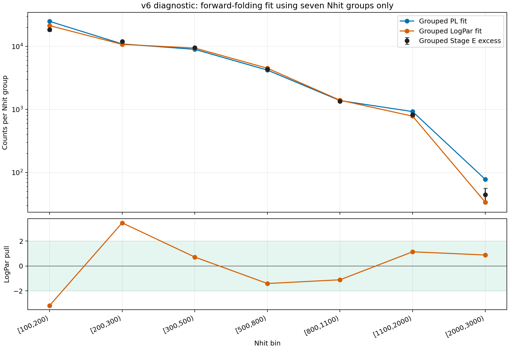

# v6 64748 Nhit-grouped forward-folding diagnostic

This is a diagnostic-only comparison. It does not replace or promote the official 44-cell `(Nhit, predE)` fit.

## Method

- Start from the official 44 selected cells.
- Aggregate Stage E excess within each of the seven Nhit bins.
- Aggregate aperture-conditioned forward-folded model counts by summing the selected cells in each Nhit bin.
- Combine conservative errors as `sqrt(sum(error_i^2))`, assuming no inter-cell covariance.
- Refit PL and LogPar to the seven grouped observations.
- Slurm job: `65135`.

## Results

| Fit | chi2 | ndof | chi2/ndof | p-value |
| --- | ---: | ---: | ---: | ---: |
| Official 44-cell LogPar | 480.5153 | 41 | 11.7199 | 2.4229e-76 |
| Nhit-only PL | 83.2884 | 5 | 16.6577 | 1.7195e-16 |
| Nhit-only LogPar | 27.8452 | 4 | 6.9613 | 1.3407e-05 |

The Nhit-only LogPar parameters are `phi0=2.35834e-12`, `alpha=2.73523`, and `beta=0.103834` at 3 TeV. Relative to the official 2D LogPar fit, the shifts are `+2.6%`, `-0.9%`, and `-3.1%`, respectively.

The two lowest Nhit groups dominate the remaining mismatch: `[100,200)` has pull `-3.17` and `[200,300)` has pull `+3.46`. Together they contribute about 79% of the grouped LogPar chi2.

## Interpretation

Grouping reduces chi2 because opposite residuals among predE cells can cancel, so this is a useful diagnostic of Nhit-level normalization but not a replacement for the 2D response fit. The grouped fit is still rejected (`p=1.34e-5`, about 4.2 sigma one-sided equivalent), showing that the problem is not exclusively redistribution within each Nhit bin. The result also assumes zero covariance among the aggregated cell errors; shared background or response systematics would require an explicit covariance matrix.

