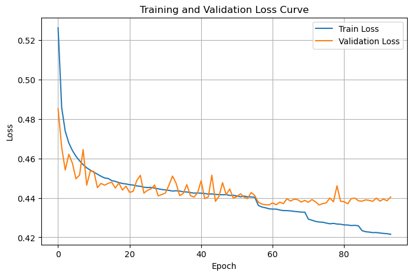
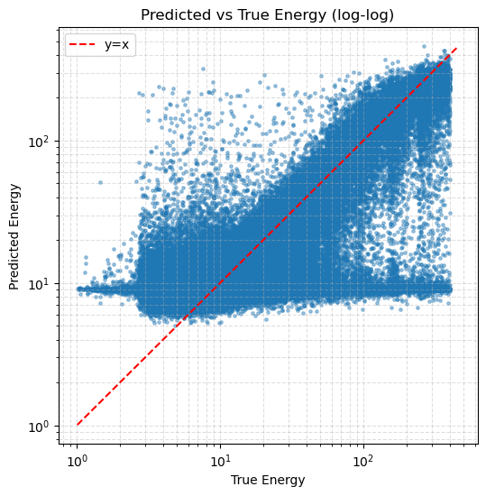
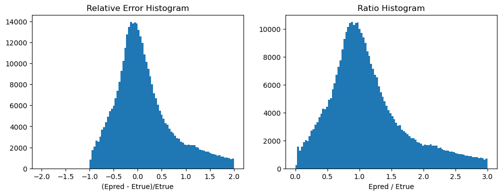
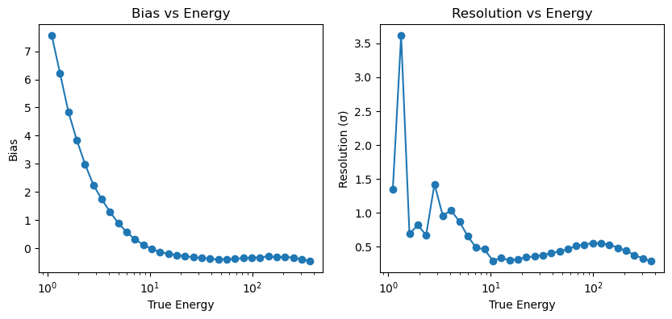
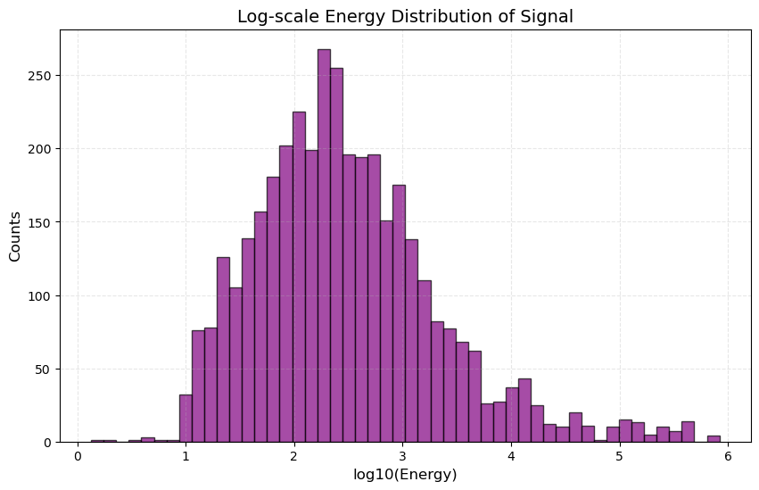

# 能量重建训练日志
## model 500分析
### 训练的参数和条件
- 训练数据量使用了500个文件，合计约130w events数据，batchsize 256
- 训练集72% val集8% 最后用来评估的数据20% 
- 输入particleNet的数据vx vy vq vt 标签mc_energy，控制长度256
- loss function采用的在log_energy下的MSE函数（均方误差）
- model saved as "best_model.pt"
### 初步结果
=== 模型评估结果 ===
- 能量分辨率 (σ): 0.8685    表示预测与真值相对误差的标准差约为 87% —— 即样本间典型误差非常大（接近一倍）。对大多数能量重建任务来说这是偏大的，说明模型预测波动很大。
- 能量偏差 (bias): 0.2006     表示平均 过高估计 20%（预测比真值高约 20%）。这是系统性误差（需要用校准或调整损失/数据来修正）
- R² Score: 0.6126  表明模型能解释大约 61% 的方差，说明模型已经学到了一些有用信息，但仍有大量可改进空间（理想上希望 >0.8 甚至更高，视问题难度而定）。

#### loss 曲线

loss曲线随着epoch降低还算平滑，模型收敛速度很快，val集合也没有明显的过拟合，随这epoch趋向平稳了
hint：
- 从模型训练角度，模型处于理想的拟合区间
- 下一步考虑：
1. 增加模型容量，加更多的层 （目前模型参数0.5m已经很大，再增大算力短期不够用）
2. 采用学习率warmup+cosine decay （感觉影响不大，只会减慢模型收敛速度）
3. val的震荡属于正常现象，可以考虑增加数据，同步增加batchsize

#### log energy 曲线

 整体对应不是非常好，尤其在低能段，偏差非常明显，在高能段稍微符合

参差分布和energy_pred/energy_true 比例，从相对误差看出，模型有点倾向于能量预测偏高

#### 分bin进行bias分析和Resolution分析

- 在 1 GeV 以下，Bias 高达 7~8，说明模型预测的能量比真实能量大 好几倍；
- 随着能量上升（>10 GeV），Bias 快速收敛到 0 附近，说明在高能段预测基本无系统性偏移；
- 数据分布不均衡：低能样本数量远多于高能，模型偏向于预测“平均能量”，导致对低能事件输出偏高。

- 下一步
1. 低能段的噪声太高，影响全局的训练，针对中高能段的重建，剔除低能段的数据（小于5GeV？）同时也剔除极高能量的数据（大于1TeV？）
2. 还有个方法改进能量差距：再loss function里对低能量事件给跟高的权重
3. log_Energy 改成log10Energy更合理！

##　下一步 model 3000
修改点：
1. ✅增大数据量6倍，对应batchsize增大到512
2. ✅数据能量分布不平衡问题：修改loss function用更符合物理的huberloss，然后加入低能权重weight = 反高斯 * 1/(E+1)
3. 数据能量分布不平衡问题:在dataloader里就给权重，使得加载数据分布平衡
4. ✅修改log_energy 到 log10Energy，应该会更平滑一些；在dataset里取的是log10，但在evaluate里返回用的是exp
5. ✅增大knn邻居数 16 -> 24 也许能提取到更到的局部特征，毕竟每个events截取hit数为256 增大knn没有显著增强
6. ✅在dataset里多线程读取，多加几个cpu核加快读取速度
best_model_2.pt

## 下下一步
500个文件 512 k=16
1. ✅考虑是不是要把能量分三个大bin来进行训练？已分bin读写了数据
2. ❌数据能量分布不平衡问题：loss里给一个反高斯分布
3. ✅没有筛出id？？？？没有把光子事件筛出来？？？
4. ✅考虑分bin进行训练和拟合？Nhit？Nhit直方图!，保证每个bin里数据量足够训练。
5. 卡vqsamp>0.5
6. MLP回归头是不是减一层256？？
7. 筛选能量大于10^2的事例
8. ✅mcenergy * weight分布？ 双对数的能量分布？Nhit的分布
9. ✅mask的数据参与运算吗？不
10. bin分60-150;150-500, 500-3000构造新的数据集,相应的截断256，512，1024
11.  vx vy vq vt 从shower plane到探测器平面？探测器平面到shower平面？？
12. gamma / hadron cuts?
13. ✅能量分辨率是logE的标准差；bias是logE的平均error
14. vnpe?number of photon-electrons of the hit这个有没有用？
15. 要不要筛选芯内或者芯外事例？
16. 收敛有点快，可以采用warmup
17. train要output bestmodel 然后传入evaluate？
18. 前8000files用于训练，后2000files用于evaluate
best_model_3.pt
best_model_60_150.pt 1000files batchsize 256 
best_model_150_500.pt 1000files batchsize 512 len 500

11.3. 把新的分bin数据集做好; 把。py执行做好；root
远程桌面！！！

## 11.10
1. EE水平带的原因可能是relu函数的截断？对一部分事件预测值集中在一个固定能量附近，无论真实能量是多少。
2. 对数据不平衡依然没有补救：一方面可以带dataset里做数据平衡，另一方面可以在loss里做数据权重的平衡
问题：
1. 训练数据不平衡或采样问题
如果训练数据在某个能量区间（如100-200 GeV）有大量样本，模型可能会过度学习这个区间，导致对其他能量的事件也预测为这个"安全值"
检查你的训练集能量分布是否均匀
2. 输入特征信息不足
对于某些事件类型（可能是低信噪比、边缘事件、或探测器响应较差的事件），输入特征可能无法提供足够信息来区分真实能量
模型在不确定时会倾向于预测训练集中的"平均值"或"众数"
3. 损失函数的问题
如果使用 MSE 类损失函数，模型可能倾向于预测接近数据集均值的值以最小化整体损失
在 log 空间，这会表现为预测值集中在某个特定区间
4. 事件质量筛选不足
这些"坏事件"可能是：
重建失败的事件
触发阈值附近的事件
多粒子污染事件
探测器边缘事件
5. 网络容量或正则化问
过度正则化可能导致模型过于保守网络在某些输入模式下可能陷入局部最优解
6. 训练时对能量做标准化，然后反标准化